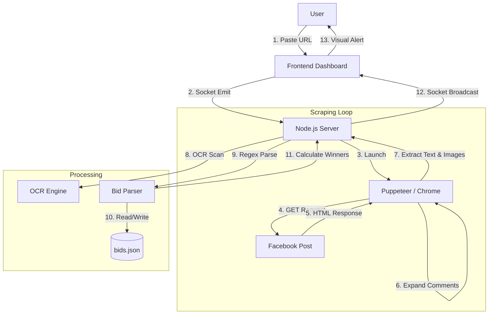

# Facebook Auction Tracker - Technical Architecture & Workflow

## 1. High-Level Overview
This application is a **Real-Time Web Scraper and Dashboard** designed to automate the monitoring of Facebook comment-based auctions. 

Because Facebook does not provide a public API for scraping group comments in real-time, this system acts as a "Robot User" (Bot). It uses a real web browser engine to visit the post, click buttons, read text, and push that data to a local dashboard.

---

## 2. The Tech Stack

### Backend (The Brain)
- **Runtime:** Node.js
- **Browser Automation:** `puppeteer-core` (Controls a local Google Chrome instance).
- **Server:** `Express.js` (Serves the dashboard and handles API requests).
- **Real-Time Comms:** `Socket.IO` (Pushes updates to the frontend instantly).
- **Database:** Local JSON Files (`bids.json`, `posts.json`) for lightweight, portable storage.
- **Image Processing:** `Tesseract.js` (OCR - Optical Character Recognition) to read bids from images.
- **Image Hosting:** `Cloudinary` (Uploads manual images for persistent hosting).

### Frontend (The Face)
- **UI:** HTML5, CSS3 (Grid/Flexbox), Vanilla JavaScript.
- **Connection:** `socket.io-client` to receive live updates without refreshing.

---

## 3. How It Works: The Logic Flow

### Phase 1: Authentication & Initialization
1. **Chrome Launch:** The app launches Chrome using your local executable (`CHROME_EXEC_PATH`).
2. **Persistence:** It uses the `--user-data-dir` flag or injects cookies from `cookies.json`. This "tricks" Facebook into thinking it is your regular browser session, bypassing the need to type a password or do 2FA.
3. **Socket Server:** The backend opens a WebSocket channel. As soon as you open `localhost:3000`, the frontend connects and waits for data.

### Phase 2: The Scraping Loop (The "Watcher")
Once you add a post URL, a `FacebookWatcher` class is instantiated. It runs an infinite loop with the following logic:

1.  **Navigation:** It goes to the Facebook Post URL.
2.  **Filter Switching:** It attempts to click the filter dropdown to switch from "Most Relevant" to **"All Comments"**. This is critical because Facebook hides "boring" comments by default, which might contain valid bids.
3.  **Expansion (Pagination):**
    *   The bot looks for XPaths/Selectors for buttons like "View more comments" or "View previous comments".
    *   It clicks them repeatedly (up to a safe limit) to load the DOM.
    *   *Technique:* It uses a "Retry with Backoff" strategy. If a click fails, it waits and tries again.
4.  **Extraction:**
    *   It selects all HTML nodes with `role="article"` (comments).
    *   It extracts: `Author Name`, `Comment Text`, `Timestamp`, and `Image URLs`.

### Phase 3: The Parsing Logic (The "Intelligence")
Raw text is useless. The system converts text into structured data using two methods:

#### A. Regex Parsing (Text Bids)
The system scans every line of text against strict patterns:
*   **Pattern:** `Item Number` + `Separator` + `Price`.
*   **Regex:** `(\d{1,3})\s*[\)\.:\-]?\s*([0-9,]+)`
*   **Logic:** It cleans the price (removes commas, dots, spaces) and validates that `Item` is between 1-50 and `Price` >= 10.

#### B. OCR Parsing (Image Bids)
If a comment contains an image (often used by admins to post summaries):
1.  The image is passed to `Tesseract.js`.
2.  **Pre-processing:** The OCR result is cleaned. Common AI mistakes are fixed (e.g., converting the letter 'l' to number '1', letter 'O' to number '0').
3.  **Summary Regex:** It looks for the specific Admin Summary format: `Item. Price - BidderName`.
    *   *Example:* `18.180-Ken Kaneki`
    *   If found, it credits the bid to "Ken Kaneki" instead of the person who posted the image (the admin).

### Phase 4: Data State & Storage
1.  **Deduplication:** The system checks `bids.json`. If a bid (Post + Item + Amount + Bidder) already exists, it ignores it.
2.  **New Bid:** If it's new, it saves it to `bids.json`.
3.  **Calculation:** It groups bids by `Item Number` and sorts them by `Amount` (Descending) to find the **Current Leader**.

### Phase 5: Broadcasting (The UI Update)
1.  The backend calculates the status for every item:
    *   **WINNING:** You are the top bidder.
    *   **OUTBID:** You bid previously, but someone else is higher.
    *   **CURRENT:** Someone else is leading, you haven't bid yet.
2.  It sends a massive JSON payload via `Socket.IO` to the browser.
3.  **Frontend Rendering:**
    *   The Javascript receives the event `socket.on('update')`.
    *   It redraws the HTML Grid.
    *   If it detects a status change (Winning -> Outbid), it triggers a visual notification in the "Activity Feed".

---

## 4. Safety Mechanisms (Anti-Ban)

Scraping Facebook is risky. The system implements "Human-Like" behavior to avoid detection:

1.  **Jitter:** The polling interval isn't exact. If you set it to 60s, it might actually wait 62.5s or 58.1s. This randomness prevents Facebook from detecting a robotic pattern.
2.  **Rate Limiting:** The backend enforces a hard minimum wait time (30s) to prevent you from accidentally DDoS-ing Facebook and getting blocked.
3.  **Static Scraping (Images):** Instead of clicking through image galleries (which triggers many network requests), it only scrapes images currently visible or manually pasted by you.
4.  **Reduced Aggression:** On page reloads, it only clicks "View More" 3 times instead of 25, assuming older comments are already loaded or less relevant.

---

## 5. Data Flow Diagram

